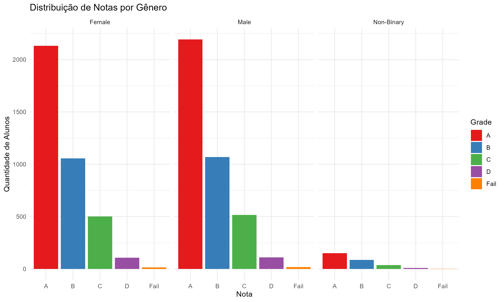
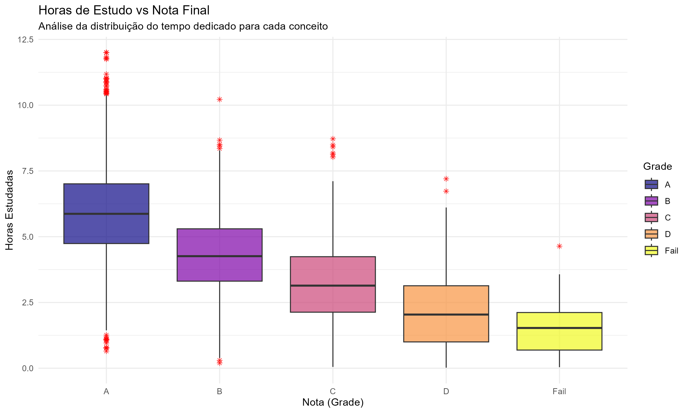
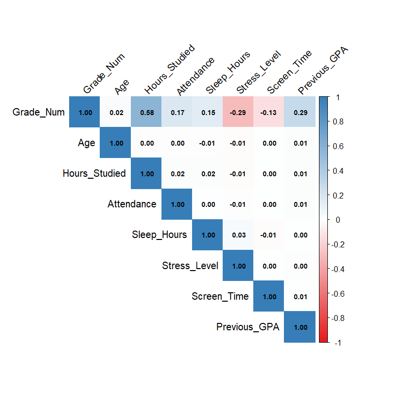

📊 Análise Visual e Exploração de Dados
A análise foi realizada com uma base de 8.000 estudantes, buscando entender os pilares que sustentam o rendimento acadêmico e os fatores que o prejudicam.

🎯 Principais Insights (Data Insights)
1- O Peso do Esforço: A quantidade de horas estudadas é o principal preditor de sucesso acadêmico ($r = 0,58$). Curiosamente, o método de estudo (Online, Offline ou Híbrido) não altera significativamente as notas ou o estresse, indicando que a intensidade do estudo é mais relevante que o formato.

2- O Fator Psicológico: O bem-estar emocional mostrou-se crucial. O estresse é o principal detrator do desempenho ($r = -0,29$), superando inclusive o impacto negativo do tempo de tela ($r = -0,13$).

3- A "Inércia" Acadêmica: Alunos com bom histórico (GPA anterior) tendem a manter o desempenho ($r = 0,29$), mas essa relação é moderada, sugerindo que o comportamento atual impacta mais que o passado.

4- Equidade de Gênero no Desempenho
A análise visual confirma que o gênero não é um fator determinante para o sucesso acadêmico nesta amostra. As proporções de conceitos (A, B, C, D e Fail) são praticamente idênticas entre alunos do sexo masculino, feminino e não-binários. Isso reforça que o desempenho está ligado a variáveis comportamentais e de esforço pessoal, e não a fatores demográficos.

🚩 Alertas Críticos

1-Epidemia de Estresse: Embora o interesse pelas aulas seja alto (apenas 15% de baixa presença), quase 50% dos alunos (3.942) apresentam níveis de estresse elevados. Isso indica um cenário de esgotamento (burnout) em alunos que estão tentando ser produtivos.

2- Equilíbrio Trabalho-Estudo: Cerca de 40% da amostra concilia os estudos com trabalho. Esse grupo é o mais vulnerável à privação de sono, com mais de 1.500 alunos dormindo menos de 6 horas diárias.

📈 Conclusão Estatística
O Heatmap de Correlação reforça que o sucesso acadêmico não é fruto de um único fator isolado, mas de um ecossistema. O tempo dedicado às matérias é o motor do desempenho, porém, o estresse elevado atua como um limitador direto desse potencial. Investir em saúde mental e suporte ao aluno trabalhador é tão vital para as notas quanto o conteúdo programático.

🚀 Recomendações e Plano de Ação
Com base nas evidências de que o estresse e o tempo de tela impactam negativamente o rendimento, propomos as seguintes intervenções para a instituição de ensino:

1- Projeto Tutoria: Cuidado Coletivo
Ação: Criação de grupos de apoio semanais mediados por psicólogos escolares.
Objetivo: Oferecer um espaço seguro para que os alunos compartilhem dificuldades acadêmicas e pessoais, promovendo a regulação emocional e reduzindo o sentimento de isolamento.
Foco: Grupos pequenos para garantir que todos tenham voz.

2- Intervenção Familiar Direta
Ação: Reuniões individuais com os pais ou responsáveis dos alunos identificados com níveis de estresse críticos (Score > 7).
Objetivo: Orientar a família sobre a necessidade de acompanhamento psicológico particular ou ajustes na rotina doméstica (higiene do sono e redução de cobranças excessivas) para preservar a saúde mental do estudante.

3- Conscientização Digital
Ação: Ciclo de palestras e workshops sobre o uso saudável da tecnologia.
Objetivo: Expor os malefícios do uso excessivo de celulares e telas, abordando temas como a luz azul, a fragmentação da atenção e o impacto direto na qualidade do sono e, consequentemente, nas notas.

🛠️ Tecnologias Utilizadas
Linguagem: R
Bibliotecas Principais: tidyverse (dplyr, ggplot2), corrplot

#### 1. Equidade de Gênero no Desempenho

#### 2. Validação das Horas de Estudo (Boxplot)

#### 3. Matriz de Interdependência (Heatmap)

